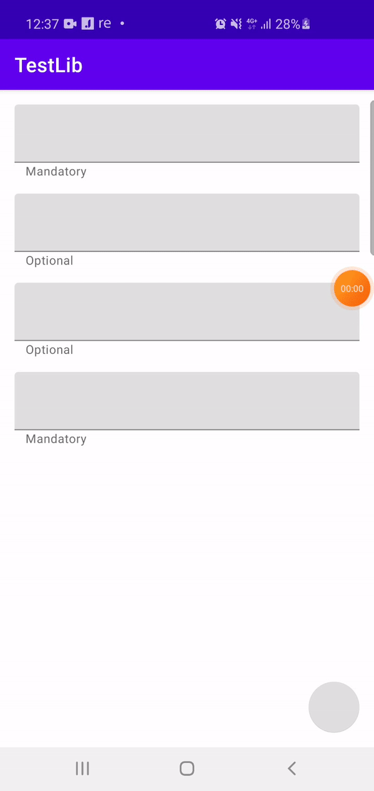

# BindingValidation

This code will help you to create fast and easy validation for screen. This code only for projects with databinding. So databinding feature should be enabled

```
    buildFeatures {
        dataBinding true
    }
```

Аdd below to your module's build.gradle

```
dependencies {
    implementation 'com.github.anbazhan:BindingValidation:VERSION'
}
```

Add it in your root build.gradle at the end of repositories:

```
allprojects {
    repositories {
        ...
        maven { url 'https://jitpack.io' }
    }
}
```

Let's create a simple validator. F.ex we need to validate some regex

```kotlin
class RegexValidator(
    override val text: String,
    override val type: EditMessageType = EditMessageType.ERROR,
    val regex: Regex
) : EditValidator<String> {

    override fun validate(value: String): Boolean =
        regex.matches(value)
}
```

Add field into your ViewModel class

```kotlin
val field = StringFieldViewModel(
    "MyFieldName",
    mutableListOf(
        RegexValidator(
            "Only digits",
            regex = Regex("[0-9]*")
        )
    )
)
```

You already can use this field as it is by adding binding into your view xml

```xml
<com.google.android.material.textfield.TextInputLayout
  android:layout_width="match_parent"
  android:layout_height="wrap_content"
  android:errorText="@{viewModel.field.error}"
  android:layout_marginHorizontal="16dp"
  android:layout_marginTop="16dp">

  <com.google.android.material.textfield.TextInputEditText
    android:layout_width="match_parent"
    android:text="@={viewModel.field.field}"
    android:enabled="@{viewModel.field.enabled}"
    android:layout_height="wrap_content" />
    
  </com.google.android.material.textfield.TextInputLayout>
```

If you need complex validation process, you can use ValidationController

Just add it into your ViewModel class and add all fiedls you need to validate using addField(...) methode

```kotlin
class MyViewModel : ViewModel() {

  val validationController = ValidationController()

  val field1 = StringFieldViewModel(...)
  val field2 = StringFieldViewModel(...)
  ...

  fun initData() {
        validationController.addField(field1)
        validationController.addField(field2)
        ...
    }
}
```kotlin

After it you can use validationController.isValid flag for checking all fields you have added. F.ex in view xml 

```xml
<com.google.android.material.floatingactionbutton.FloatingActionButton
            android:id="@+id/fab"
            android:layout_width="wrap_content"
            android:layout_height="wrap_content"
            android:enabled="@{viewModel.validationController.isValid}"
            android:onClick="@{() -> viewModel.save()}"
            android:layout_gravity="end|bottom"
            android:layout_margin="16dp" />
```



You can find examples of code on branch sample
